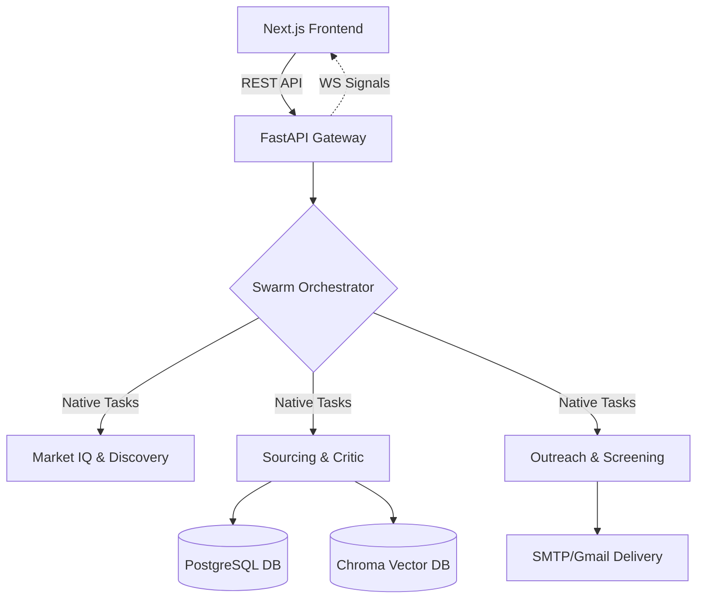

<div align="center">
  
  <h1>DVT Talent AI</h1>
  <p><strong>Elite Autonomous Recruitment Swarm & Copilot (v1.1)</strong></p>
  
  <p>
    
    
    
    
  </p>
</div>

---

DVT Talent AI is a production-hardened, full-stack platform that completely automates the recruitment pipeline using a specialized swarm of **7 high-performance Pydantic AI Agents**. Dressed in a premium **Elite Enterprise** aesthetic, it features two execution modes through the **Swarm Command Center**: a **Fully Autonomous Autopilot** for high-volume discovery, and a **Stateful Copilot** with human-in-the-loop (HITL) checkpoints to ensure absolute brand safety.

## 🚀 Key Features

* **Advanced Swarm Architecture (Pydantic AI):**
  * **Market IQ Agent:** Analyzes macroeconomic trends to identify high-intent target companies.
  * **Discovery Agent:** Synthesizes optimized, high-converting job descriptions from market signals.
  * **Sourcing Agent:** Globally discovers and verifies candidates across GitHub, LinkedIn, and internal nodes.
  * **Logic Critic (Audit):** High-level verification layer to prevent hallucinations and ensure data integrity.
  * **Screening Agent:** Multi-modal ranking engine for resume scoring and psychometric alignment.
  * **Outreach Agent:** Generates hyper-personalized emails and dynamic candidate microsites.
  * **Analytics Agent:** Closes the loop with real-time performance metrics and strategy refinement.
* **Native Orchestration Engine:**
  * Uses **FastAPI BackgroundTasks** for instant, high-concurrency swarm execution without legacy task queue overhead.
  * **Real-time Telemetry:** 60FPS "Neural Log" stream powered by Redis PUB/SUB and WebSockets.
* **Enterprise-Grade Security:** 
  * Hardened multi-tenancy at both Relational (PostgreSQL) and Vector (ChromaDB) layers.
  * Secure JWT-based identity with automatic tenant isolation for all agent activities.

## 🏗️ Architecture



## 🛠️ Tech Stack

### **Backend**
* **Framework:** FastAPI (Python 3.11+)
* **Agent Engine:** Pydantic AI (Structured Intelligence)
* **Orchestration:** Native BackgroundTasks + Redis PUB/SUB
* **Databases:** PostgreSQL (SQLAlchemy Async), ChromaDB (Vector Search)
* **AI Models:** Anthropic (Claude 3.5), OpenAI (GPT-4o), DeepSeek

### **Frontend**
* **Framework:** Next.js (TypeScript)
* **Styling:** Tailwind CSS + Framer Motion
* **Real-time:** WebSockets + TanStack Query

## 💻 Getting Started (Local Development)

### 1. Requirements
* Docker Desktop installed and running
* Node.js v18+
* Python 3.11+

### 2. Backend Setup
```bash
cd backend
python -m venv venv
source venv/bin/activate  # Windows: `venv\Scripts\activate`
pip install -r requirements.txt
# Start API (IPv4 standard)
uvicorn main:app --reload --host 127.0.0.1 --port 8000
```

### 3. Frontend Setup
```bash
cd frontend
npm install --legacy-peer-deps
npm run dev
```
*Note: Use http://127.0.0.1:3000 to avoid common localhost/IPv6 connectivity issues.*

## 🛡️ Trust & Brand Safety
DVT Talent AI prioritizes human agency. The **Critic Agent** audits every sourcing match, while the **Copilot** architecture ensures no communication is sent without human approval of the underlying JD and candidate dossiers. 

## 📄 License
Proprietary Core. DO NOT redistribute without express permission.
