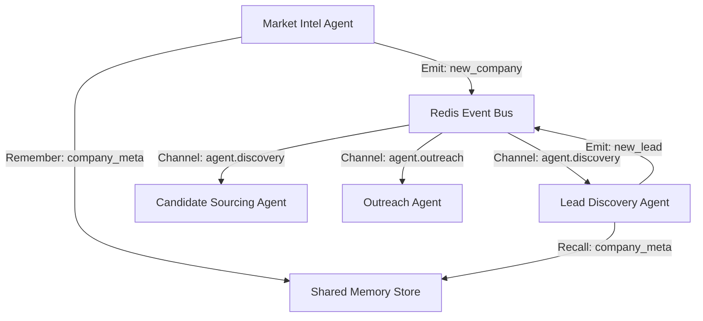

# DVT Talent AI — Agent Communication Fabric

The **Communication Fabric** enables a loosely coupled, event-driven architecture for the DVT Talent AI agent swarm. While the `AsyncDAGOrchestrator` maintains the high-level strategic pipeline, individual agents can now share memory and trigger reactive workflows in real-time.

## 🏗️ Architecture


## 🧠 Shared Memory Layer
Agents use `SharedMemory` to store transactional state that other agents might need.
- **Key Pattern**: `{entity}:{id}:{suffix}`
- **TTL**: Default is 1 hour (3600s).

### Usage
```python
# To remember something
await self.remember("company:spacex:tech_stack", {"stack": ["Rust", "C++"]})

# To recall something
data = await self.recall("company:spacex:tech_stack")
```

## 📡 Event Bus
The `EventBus` uses Redis Pub/Sub for cross-agent signaling.

### Standard Channels
- `agent.discovery`: New companies, leads, or candidates.
- `agent.analysis`: Scoring results or integrity checks.
- `agent.outreach`: Booking status or email/voice reactions.

### Emitting Events
```python
await self.emit("new_company", {"name": "SpaceX", "domain": "spacex.com"})
```

### Reacting to Events
1. Declare interest in `__init__`:
   `self.interested_events = ["new_company"]`
2. Override `on_event`:
```python
async def on_event(self, event_type, data):
    if event_type == "new_company":
        # Start work immediately!
        await self.run_async(company_name=data["name"])
```

## 📜 Data Contracts
All events MUST follow the schemas defined in `backend/communication/schemas.py`.

## 🛠️ Troubleshooting
- **Redis Connection**: Ensure `REDIS_URL` in `.env` is correct. The bus will log `event_bus_error` if connection is lost.
- **Non-blocking Callbacks**: Agents handle events in background tasks (`asyncio.create_task`). Ensure shared resources (like DB sessions) handle concurrency safely.
