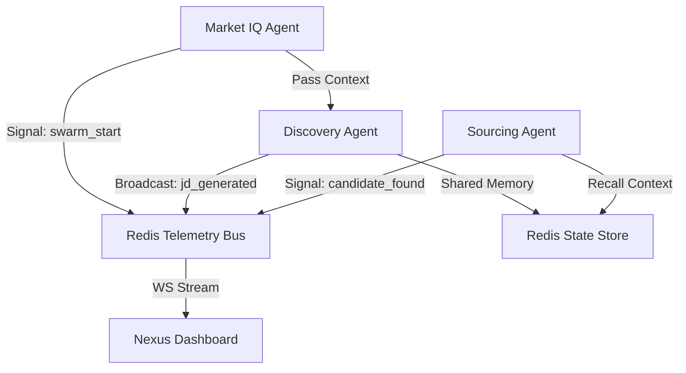

# DVT Talent AI — Agent Communication Fabric (v1.1)

The **Communication Fabric** enables a loosely coupled, event-driven architecture for the DVT Talent AI agent swarm. With the migration to **Pydantic AI**, agents now utilize a dual-layer communication strategy: **Direct Context Sharing** for task-specific data and **Event-Driven Telemetry** for global visibility.

## 🏗️ Architecture


## 🧠 Shared Context (Pydantic AI)
Agents share critical resources and tenant isolation metadata via the `AgentDeps` object. This is passed through the `RunContext` at each step of the pipeline.

### Shared Dependencies
- **HTTP Client**: A unified `httpx.AsyncClient` for all web requests.
- **Tenant ID**: Ensures every agent operation is strictly isolated to the current user's workspace.
- **Global Settings**: Access to shared LLM configurations and mock-mode toggles.

## 📡 Telemetry & Event Bus
The `EventBus` uses Redis Pub/Sub to broadcast real-time signals to the **Nexus Dashboard**.

### Telemetry Signals
- `agent_start`: Broadcast when an agent begins a new sequence.
- `agent_info`: Detailed progress logs (displayed in the Neural Stream).
- `agent_success`: Confirmation of task completion.
- `agent_error`: Graceful failure reports with error context.

### Emitting Signals
```python
# Via the orchestrator or tasks relay
broadcast_signal(
    message="Scanning market for technology roles...",
    signal_type="agent_info",
    tenant_id=current_tenant_id
)
```

## 📜 Data Integrity
With **Pydantic AI**, all agent-to-agent data transfer is strictly validated using Pydantic models. This eliminates the "Hallucination Gap" common in legacy string-based agent communication.

## 🛠️ Troubleshooting
- **WebSocket Handshake**: If the dashboard shows "Disconnected," verify the JWT contains a valid `tenant_id`.
- **Redis Connectivity**: The telemetry stream requires an active Redis server on `127.0.0.1:6379`.
